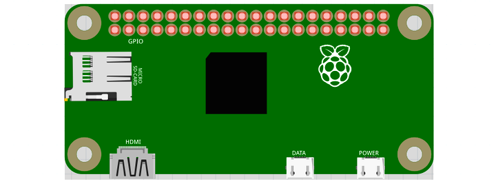

# Raspberry Pi Model Zero

This is the base Nerves System configuration for the Raspberry Pi Zero and
Raspberry Pi Zero W.


<br><sup>[Image credit](#fritzing)</sup>

| Feature              | Description                     |
| -------------------- | ------------------------------- |
| CPU                  | 1 GHz ARM1176JZF-S              |
| Memory               | 512 MB                          |
| Storage              | MicroSD                         |
| Linux kernel         | 4.4 w/ Raspberry Pi patches     |
| IEx terminal         | OTG USB serial port (`ttyGS0`). Can be changed to HDMI or UART. |
| GPIO, I2C, SPI       | Yes - Elixir ALE                |
| ADC                  | No                              |
| PWM                  | Yes, but no Elixir support      |
| UART                 | 1 available - `ttyAMA0`         |
| Camera               | Yes - via rpi-userland          |
| Ethernet             | Yes - via OTG USB port          |
| WiFi                 | Pi Zero W or IoT pHAT           |
| Bluetooth            | Not supported yet               |

## Supported OTG USB modes

The base image activates the `dwc2` overlay, which allows the Pi Zero to appear as a
device (aka gadget mode). When plugged into a host computer via the OTG port, the Pi
Zero will appear as a composite ethernet and serial device.

When a peripheral is plugged into the OTG port, the Pi Zero will act as USB host, with
somewhat reduced performance due to the `dwc_otg` driver used in other base systems like
the official `nerves_system_rpi`.

## Supported WiFi devices

The base image includes drivers for the Red Bear IoT pHAT and the onboard
Raspberry Pi Zero W wifi module (`brcmfmac` driver).

If you are using another WiFi module (for example, a USB module), you will
need to create a custom system image. Before doing this, check if the
[nerves_system_rpi](https://github.com/nerves-project/nerves_system_rpi) works
better for you. That image configures the USB port in host mode by default and
is probably more appropriate for your setup.

## Installation

Add `nerves_system_rpi0` to your list of dependencies in mix.exs:

```
  def deps do
    [{:nerves_system_rpi0, "~> 0.12.0"}]
  end
```
[Image credit](#fritzing): This image is from the [Fritzing](http://fritzing.org/home/) parts library.
